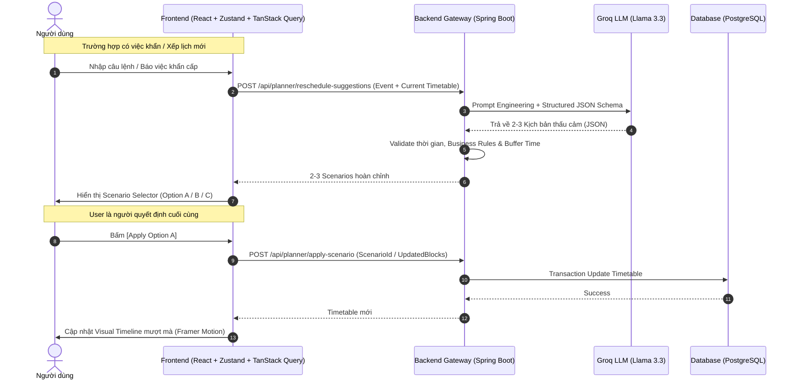

# BẢN ĐẶC TẢ YÊU CẦU SẢN PHẨM (PRD)
# DỰ ÁN: ADAPTIVE PLANNER – AI TIMETABLE FOR NEURODIVERGENT USERS

---

## 1. TỔNG QUAN DỰ ÁN (EXECUTIVE SUMMARY)

* **Tên sản phẩm:** Adaptive Planner (Trợ lý Thời gian Biến thiên Thích ứng).
* **Đối tượng mục tiêu:** Người neurodivergent, đặc biệt những người gặp khó khăn với quản lý thời gian, chức năng điều hành (executive function), chuyển đổi tác vụ hoặc dễ bị quá tải nhận thức. *Ví dụ: ADHD, autism và các trải nghiệm neurodivergent khác.*
* **Định vị cốt lõi (Core Story):** 
  > *"When your plan breaks, Adaptive Planner helps you understand what changed and choose how to adapt."*
  > 
  > Adaptive Planner không phải là công cụ "AI tự ý quản lý cuộc sống", mà là trợ lý thông minh giúp nhận diện tác động khi lịch trình bị vỡ, đưa ra các kịch bản thích ứng rõ ràng và trao quyền quyết định hoàn toàn cho người dùng.
* **Mục tiêu cốt lõi:** Chuyển đổi việc quản lý thời gian từ trạng thái "Áp lực – Căng thẳng – Dễ bỏ cuộc" sang "Thấu cảm – Tự động hóa linh hoạt – Không phán xét (Zero-Guilt)".

---

## 2. NGHIÊN CỨU TÂM LÝ & ĐẶC ĐIỂM NGƯỜI DÙNG

| Khó khăn / Điểm nghẽn | Cơ chế tác động | Giải pháp trên Adaptive Planner |
| :--- | :--- | :--- |
| **1. Time Blindness** *(Mất cảm nhận thời gian)* | Khó định lượng 30p hay 1h; chỉ có 2 mốc thời gian: "BÂY GIỜ" và "CHƯA ĐẾN (quên)". | **Visual Time-Blocking** trực quan với dải màu dịu mắt, thanh đếm ngược thời gian thực, nổi bật rõ ràng "NOW" vs "NEXT". |
| **2. Executive Dysfunction** *(Tê liệt khi bắt đầu)* | Cảm thấy choáng ngợp trước các đầu việc phức tạp, không biết bắt đầu từ đâu. | **Magic Task Breakdown**: AI chia nhỏ task lớn thành 3-5 micro-steps siêu dễ (dưới 5 phút) để kích hoạt hành động. |
| **3. Waiting Mode Paralysis** *(Tê liệt chờ đợi)* | Nếu có lịch hẹn lúc 16:00, cả buổi từ 13:00 - 16:00 sẽ không dám làm gì vì sợ lỡ giờ. | AI tự động chèn **"Buffer / Transition Time"** (khoảng đệm chuẩn bị tâm lý và di chuyển), giúp người dùng an tâm làm việc vi mô. |
| **4. Cognitive Overload & Meltdown** *(Hoảng loạn khi vỡ lịch)* | Khi có việc khẩn chen ngang, lịch bị đảo lộn gây hoảng loạn và muốn từ bỏ toàn bộ lịch. | **AI-Assisted Dynamic Reschedule**: AI phân tích tác động, đề xuất 2-3 kịch bản cân bằng lại lịch để người dùng chọn áp dụng. |
| **5. Quá tải năng lượng (Spoon Theory)** | Năng lượng dao động bất thường (Hyperfocus vs Low Energy). | **Energy Awareness**: Phát hiện lịch có nhiều block High Focus liên tiếp để gợi ý thời gian nghỉ ngơi kịp thời. |
| **6. PDA & Quyền tự quyết (Autonomy)** | Cảm giác bị kiểm soát hay phán xét sẽ kích hoạt phản xạ chống đối, bỏ dùng app. | **Zero-Guilt Tone & User Agency**: AI chỉ đóng vai trò gợi ý; hệ thống chỉ áp dụng thay đổi khi người dùng xác nhận. |

---

## 3. CƠ CHẾ HOẠT ĐỘNG & TÍNH NĂNG CỐT LÕI

### 3.1. Luồng trải nghiệm thích ứng cốt lõi (Core Adaptive Loop)

```
              USER
                │
                ▼
        ┌───────────────┐
        │ Personal      │  (Quản lý Timetable riêng trên Web,
        │ Timetable     │   không phụ thuộc Calendar bên ngoài)
        └───────┬───────┘
                │
          Biến cố / Việc khẩn cấp phát sinh
                │
                ▼
        ┌───────────────┐
        │ AI Understand │  (Nhận diện xung đột & phân tích
        │ the impact    │   tác động lên toàn bộ ngày)
        └───────┬───────┘
                │
                ▼
        ┌───────────────┐
        │ 2–3 Options   │  (Sinh kịch bản: Tối ưu ngày / Tiết kiệm năng lượng / Dời việc)
        └───────┬───────┘
                │
                ▼
             USER          (Người dùng xem trước & bấm [Apply] chọn phương án)
          chooses one
                │
                ▼
        ┌───────────────┐
        │ Adapt         │  (Hệ thống cập nhật Timeline sau khi User xác nhận)
        │ Timetable     │
        └───────────────┘
```

---

### 3.2. Chi tiết các tính năng

#### A. Trợ lý Xếp lịch Hội thoại AI (Natural Language AI Planning)
* Người dùng nhập ngôn ngữ tự nhiên: *"Tối nay 7h tôi muốn đi cafe với bạn bè tầm 2 tiếng, sau đó về đọc sách."*
* AI phân tích: Nhận diện thời gian, thời lượng, tính chất công việc $\rightarrow$ Quét lịch trống $\rightarrow$ Tự động xếp vào timeline kèm 15 phút Buffer Time chuyển tiếp.

#### B. Tái cấu trúc lịch thích ứng (AI-Assisted Dynamic Reschedule)
* **Nguyên tắc tôn trọng quyền tự quyết (User Agency):** 
  * AI không tự ý thay đổi hoặc xóa các sự kiện quan trọng nếu chưa có sự xác nhận của người dùng.
* **Giao diện lựa chọn kịch bản (Scenario Selector):**
  * **Phương án A (Tối ưu trong ngày):** Rút ngắn việc linh hoạt, chèn việc khẩn, dời nhẹ các việc sau $\rightarrow$ Nút `[Apply Option A]`.
  * **Phương án B (Tiết kiệm năng lượng - Zero-Guilt):** Tạm hoãn việc không khẩn thiết sang ngày mai, dành trọn năng lượng cho việc gấp $\rightarrow$ Nút `[Apply Option B]`.
  * **Phương án C (Giữ nguyên & Tìm khung giờ khác):** Tìm khung giờ trống khác phù hợp cho việc mới $\rightarrow$ Nút `[Apply Option C]`.
* Hệ thống chỉ áp dụng thay đổi vào Timetable sau khi người dùng bấm chọn xác nhận.

#### C. Hệ thống Nhắc nhở Đa tầng Tùy biến (Chambered Notifications)
* Cho phép người dùng tùy chỉnh số phút thông báo trước cho từng block công việc (trước 5p, 15p, 30p hoặc tùy chỉnh).
* Hỗ trợ các bước chuyển tiếp tâm lý (T-30m chuẩn bị tinh thần, T-10m dọn dẹp, T-0m bắt đầu).
* Âm thanh và thông báo êm dịu (Sensory-friendly), không giật mình.

#### D. Hỗ trợ Nhận thức & Năng lượng (Cognitive & Energy Support)
* **Gợi ý nghỉ ngơi:** AI phát hiện lịch có nhiều block High Focus liên tiếp hoặc tổng thời lượng tập trung cao vượt ngưỡng và gợi ý thời gian nghỉ ngơi (AI hỗ trợ quyết định, không giả định chẩn đoán sức khỏe).
* **Magic Task Breakdown:** Nút *"Break it down"* giúp bẻ nhỏ 1 task lớn thành 3-5 micro-steps dưới 5 phút để kích hoạt dopamine hành động.

---

## 4. PHÂN BỔ ĐỘ ƯU TIÊN PHÁT TRIỂN (MVP SCOPE)

Nhằm đảm bảo sản phẩm hoàn thiện chỉn chu và đúng hạn, các tính năng được phân cấp rõ ràng:

### ⭐ MUST HAVE (P1 - Core MVP Loop)
1. **Personal Timetable:** Hệ thống thời gian biểu cá nhân riêng biệt, độc lập trên Web (không phụ thuộc bên thứ 3).
2. **Visual Timeline:** Giao diện trực quan phân biệt rõ ràng **NOW** (Hiện tại), **NEXT** (Sắp tới) và Past (Đã qua).
3. **Natural Language AI Planning:** Nhập liệu bằng ngôn ngữ tự nhiên để AI xếp lịch.
4. **Conflict Detection:** Phát hiện trùng lặp hoặc việc khẩn cấp chen ngang.
5. **AI-Assisted Dynamic Reschedule:** AI phân tích tác động khi vỡ lịch.
6. **2–3 Alternative Scenarios:** Sinh 2-3 kịch bản tái cấu trúc lịch rõ ràng.
7. **User Confirmation:** Người dùng chủ động chọn kịch bản và bấm `[Apply]` để xác nhận.
8. **Transition Buffer:** Tự động chèn khoảng đệm 5-15 phút giữa các tác vụ.

### 🟡 SHOULD HAVE (P2 - Trợ lực nhận thức)
9. **Customizable Notifications:** Cài đặt số phút gửi thông báo nhắc trước cho mỗi khung giờ.
10. **"What should I do now?" Assistant:** Nút bấm nhanh để AI tóm tắt việc cần tập trung ngay lúc này.
11. **Transition Assistant:** Nhắc nhở chuẩn bị tâm lý trước khi chuyển việc.
12. **Magic Task Breakdown:** Bẻ nhỏ đầu việc phức tạp thành các bước vi mô.

### 🔵 NICE TO HAVE (P3 - Mở rộng trải nghiệm)
13. **Energy Tracker & Rest Suggester:** Gợi ý nghỉ ngơi khi có nhiều block High Focus liên tiếp.
14. **Drag & Drop Timeline:** Kéo thả linh hoạt các khung giờ trên giao diện.
15. **Sensory Themes:** Chế độ Warm Light Mode / Muted Dark Mode bảo vệ thị giác.
16. **Sound Customization:** Tùy biến âm thanh chuông nhắc êm dịu.
17. **Daily Summary:** Tổng kết nhẹ nhàng các việc đã hoàn thành trong ngày (Zero-Guilt).

---

## 5. THIẾT KẾ TRẢI NGHIỆM & GIAO DIỆN (NEURO-INCLUSIVE UI/UX)

1. **Màu sắc & Thị giác:**
   * Sử dụng bảng màu Muted / Pastel dịu mắt (Sage Green, Soft Slate, Warm Amber, Deep Night Slate), cấm sử dụng các màu neon chói gắt.
   * Hỗ trợ Warm Theme và Muted Dark Mode.
2. **Visual Focus Tracker:**
   * Làm nổi bật rõ ràng block "Hiện tại" (`NOW`), làm mờ nhẹ các task đã xong, task tương lai ở trạng thái màu dịu.
   * Thanh tiến trình thời gian trực quan (visual progress bar) giúp người dùng "nhìn thấy" thời gian trôi qua mà không bị stress.
3. **Thao tác mượt mà & Không phán xét:**
   * Thao tác chọn kịch bản rõ ràng, minh bạch.
   * Thông điệp và giọng điệu luôn mang tính hỗ trợ, khích lệ thay vì thông báo lỗi mang tính trừng phạt.

---

## 6. KIẾN TRÚC HỆ THỐNG & TECH STACK (SYSTEM ARCHITECTURE)

### 6.1. Nguyên tắc kiến trúc cốt lõi (Core Architecture Principle)
> **"AI chỉ Understand + Explain + Suggest; Backend chịu trách nhiệm Validate + Calculate + Apply; User luôn là người Decide."**

### 6.2. Tech Stack lựa chọn
* **Frontend:**
  * **Framework & Build:** React 18+ + TypeScript + Vite
  * **Styling & Icons:** Tailwind CSS (bảng màu Muted/Pastel tùy biến), Lucide React
  * **Animations & Micro-interactions:** Framer Motion (hiệu ứng chuyển tiếp mềm mại, giảm giật mắt)
  * **State Management:**
    * **Zustand:** Quản lý Client/UI state (active block, AI chat panel, scenario preview, temporary changes).
    * **TanStack Query (React Query):** Quản lý Server state (fetch, cache, synchronize timetable data, mutation).
* **Backend:**
  * **Framework:** Spring Boot 3+ (Java 17/21)
  * **Database:** PostgreSQL (Lưu trữ quan hệ `TimeBlock`, `Category`, `UserPreference`)
  * **Vai trò Gateway:** Giữ bí mật Groq API Key, Prompt Engineering, parse & validate Structured JSON từ LLM, áp dụng Business Logic trước khi trả về Client.
* **AI Engine:**
  * **Provider:** Groq API (Mô hình: `llama-3.3-70b-versatile` hoặc `llama-3.1-8b-instant`)
  * **Đặc tính:** Tốc độ inference siêu tốc (< 500ms), hỗ trợ JSON Mode / Structured Output.

### 6.3. Sơ đồ luồng xử lý dữ liệu (Data & Decision Flow)



### 6.4. Mô hình dữ liệu TimeBlock (Data Model)
```typescript
interface TimeBlock {
  id: string;
  title: string;
  startTime: string; // ISO 8601
  endTime: string;   // ISO 8601
  category: 'work' | 'social' | 'health' | 'rest' | 'urgent';
  energyLevel: 'high' | 'medium' | 'low';
  reminderMinutesBefore: number[]; // [30, 10, 0]
  isCompleted: boolean;
  microSteps?: { id: string; text: string; done: boolean }[];
  isBufferBlock?: boolean;
}
```

